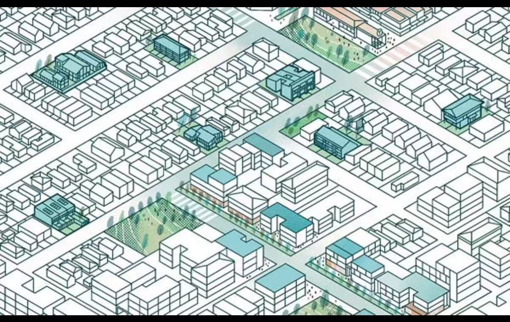

# Audio-Generated Isometric City

This project is an original p5.js interactive visual work. It creates a clean architectural 2.5D city map that gradually fills with buildings generated from an uploaded audio track.

## Inspiration

Our visual direction is inspired by clean isometric urban planning drawings: pale map backgrounds, fine architectural linework, cyan rooftops, soft road grids, and small green public spaces.

The reference image is used only as a visual style reference. The final city is generated in code and is not a copy of the image.

## Techniques

The prototype uses p5.js to draw an isometric city from grid coordinates. The main `sketch.js` file manages the shared city state, generated roads, building lots, parks, and rendering helpers such as `isoToScreen()`, `drawIsoTile()`, and `drawIsoBuilding()`.

The audio mechanic uses the browser Web Audio API `AnalyserNode` to analyse an uploaded track. As music plays, audio energy expands the street network from the city centre and creates nearby building-generation requests. Each building stores the exact music time and frequency values that generated it.

The time mechanic runs an automatic day cycle that changes the background colour and building tint while preserving the clear architectural map style.

## Mechanic Ownership

- Overall structure: Zhang Wang
- Audio mechanic: Zhang Wang
- Time mechanic: Zhang Wang
- Randomness mechanic: teammate file placeholder in `js/random-mechanic.js`
- User input mechanic: teammate file placeholder in `js/input-mechanic.js`

## AI Acknowledgement

ChatGPT/Codex was used to help plan the modular file structure, generate the initial p5.js city prototype, and draft code comments explaining how the mechanics connect. The code includes comments noting this assistance.

## External References

- p5.js: https://p5js.org/
- Web Audio API AnalyserNode: https://developer.mozilla.org/en-US/docs/Web/API/AnalyserNode

## Interaction Instructions

1. Open `index.html` in a browser.
2. Click `Choose Audio` and select a local music file.
3. Click `Play`.
4. Watch streets and buildings grow outward from the centre of the map.
5. Hover over generated buildings to highlight them.
6. Click a building to view its generation archive, including timestamp, frequency values, height, type, and random seed.
7. Choose another audio file to clear the current map and start a new city.
