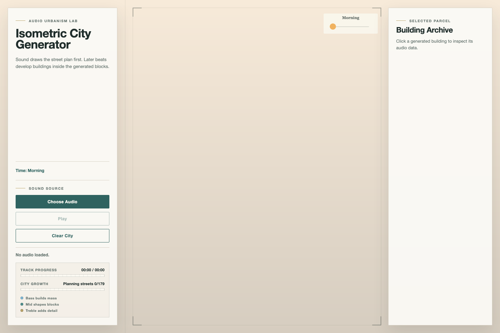

# Audio-Generated Isometric City

This is an original p5.js project that uses music to build a 2.5D isometric city. The city starts as an empty planning map. When an audio track plays, the road network appears first, then buildings are generated inside the blocks. Each building keeps a small record of the sound moment that created it, including the timestamp, audio level, dominant frequency band, and random seed.

Our team chose **Option 2: create an original interactive visual work from scratch**.

## Inspiration

Our visual reference is an architectural isometric city drawing. We liked its clean linework, pale background, cyan-green roofs, simple building forms, and quiet map-like feeling. We used this image as a style guide rather than a layout to copy.


The main idea is to treat music as a city plan. Instead of using sound only as a decorative visual effect, the track becomes the rule that controls when the city grows and what kind of data each building stores.



## Techniques

### p5.js isometric drawing

The main canvas is drawn in `js/sketch.js`. The function `isoToScreen()` converts grid positions into isometric screen coordinates. Roads, parks, building bases, facades, rooftops, shadows, windows, and hover outlines are then drawn from those grid positions.

### Audio analysis

The audio mechanic is in `js/audio-mechanic.js`. It follows the Week 12 p5.sound approach by using `loadSound()` to load a selected audio file, `p5.Amplitude` to read overall loudness, and `p5.FFT` to separate the sound into bass, mid, and treble ranges. These values affect the growth rhythm, the dominant band saved into each building, roof accent marks, and the information shown in the archive panel.

### Audio-paced generation

When a track is loaded, the project reads its duration and adjusts the target number of buildings. This helps a short track create a smaller city and a longer track create a larger one. The goal is for the city to keep growing through most of the song instead of finishing too early.

The interface also shows the current track position and city growth stage. The city progress label changes from street planning to building construction, and the small band legend explains how bass, mid, and treble influence the generated city.

### Randomness and noise

The randomness mechanic is in `js/random-mechanic.js`. It combines random values with p5.js noise to create stable but varied building heights. It also creates a street blueprint, so the map still feels planned rather than completely scattered.

### Time mechanic

The time mechanic is in `js/time-mechanic.js`. It runs a slow day-night cycle. The cycle changes the background colour, building tint, shadow direction, shadow strength, and night window lights.

### User input

The input mechanic is in `js/input-mechanic.js`. The user can hover over a building to highlight it and click a building to open its archive. The archive shows the sound and generation data connected to that building.

## Outside Course Techniques

Some techniques may go beyond the weekly class examples, so their sources and principles are listed here.

- **p5.sound frequency analysis:** The audio mechanic follows the Week 12 sound lecture. `loadSound()` loads the selected audio file, `p5.Amplitude` returns a loudness value between 0 and 1, and `p5.FFT` divides the sound into frequency data. The project maps this data into bass, mid, and treble values, then uses those values to pace street and building generation.
- **Isometric projection:** The city is drawn with a custom 2.5D projection rather than a 3D engine. `isoToScreen()` maps each grid cell with `(x - y)` for horizontal placement, `(x + y)` for vertical placement, and subtracts building height from the y position. Buildings are sorted from back to front before drawing so nearer buildings cover farther ones.
- **p5.js noise and random values:** Random values create variation, while `noise()` keeps nearby height values smoother and more organic. Combining them stops the city from looking either too uniform or completely chaotic.
- **Colour and vector interpolation:** `lerpColor()` blends between day, sunset, and night colours. `p5.Vector.lerp()` finds points along building edges, which helps draw windows, roof details, and facade lines accurately on isometric faces.

## Mechanic Ownership

| Team member | Student ID | Mechanic / role | Work described |
| --- | --- | --- | --- |
| Zhang Wang | zwan0001 | Overall structure, audio mechanic, time mechanic | Built the shared city structure, connected the mechanic files, implemented audio-paced city growth, and added the day-night visual layer. |
| Shaojie Dai | sdai0419 | User input mechanic | Handles hover feedback, building selection, and the building archive panel. |
| Shuaiyu Zhou | szho0686 | Randomness mechanic | Handles random/noise-based height variation and the randomized street blueprint. |

## Interaction Instructions

1. Open `index.html` in a browser.
2. Click **Choose Audio** and select an audio file.
3. Click **Play**.
4. Watch the streets appear first, then the buildings grow inside the generated blocks.
5. Hover over buildings to highlight them.
6. Click a building to inspect its archive data.
7. Press **Escape** to clear the selected building.
8. Click **Clear City** to reset the map and replay the current audio from the start.

Some sample music files are included in `assets/music/`, but the project also works with any local audio file selected by the user.

## File Structure

```text
.
├── index.html
├── style.css
├── readme.md
├── assets/
│   ├── project-screenshot.png
│   ├── reference-isometric-city.jpg
│   └── music/
└── js/
    ├── sketch.js
    ├── audio-mechanic.js
    ├── time-mechanic.js
    ├── random-mechanic.js
    └── input-mechanic.js
```

`sketch.js` manages the shared city state and rendering. Each mechanic is kept in its own JavaScript file, following the modular structure required by the brief.

## AI Acknowledgement

ChatGPT/Codex was used to help with planning, debugging, README drafting, and parts of the p5.js implementation. Code sections that were generated or refined with AI help are marked with comments in the JavaScript files. The team reviewed the output and made the project decisions, including the concept, visual direction, interaction design, and final mechanic behaviour.

## External References

- [p5.js](https://p5js.org/) was used for canvas drawing, animation, colour, interaction, noise, and random values.
- [p5.js reference: noise()](https://p5js.org/reference/p5/noise/) explains smooth noise values, used here for varied but coherent building heights.
- [p5.js reference: random()](https://p5js.org/reference/p5/random/) explains random number selection, used here for height variation, street spacing, park placement, and generated detail.
- [p5.js reference: lerpColor()](https://p5js.org/reference/p5/lerpColor/) explains colour interpolation, used here for the day-night cycle and time-based colour tinting.
- [p5.js reference: p5.Vector.lerp()](https://p5js.org/reference/p5.Vector/lerp/) explains vector interpolation, used here to place windows and details along isometric building faces.
- [p5.js reference: loadSound()](https://p5js.org/reference/p5/loadSound/) explains loading audio files into a p5 sketch.
- [p5.js reference: p5.Amplitude](https://p5js.org/reference/p5.Amplitude/) explains overall loudness analysis, used here for the audio level stored in each building record.
- [p5.js reference: p5.FFT](https://p5js.org/reference/p5.FFT/) explains frequency analysis, used here for bass, mid, and treble data.
- `assets/reference-isometric-city.jpg` is a team-supplied visual style reference for the clean isometric city look.

## Notes

The project loads p5.js from a CDN, so an internet connection is needed unless the library is downloaded locally. Audio files are selected from the user's computer and are not uploaded anywhere.
